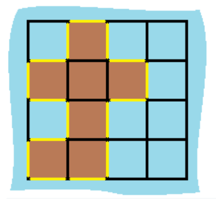

# 463. Island Perimeter

## 題目

[Island Perimeter - LeetCode](https://leetcode.com/problems/island-perimeter/)



```
Input: grid = [[0,1,0,0],[1,1,1,0],[0,1,0,0],[1,1,0,0]]
Output: 16
Explanation: The perimeter is the 16 yellow stripes in the image above.
```

- 求出島嶼周長
- 0 是水，1 是陸地
- `[0,1,0,0]` 代表第一列
- 以上圖來說就是一個 4 \* 4 的面積

## 思路

1. 每一個會有 `4` 個邊
2. 兩個相鄰的話會有 `6` 個邊（4 \* 2 - 2 \* 1）
3. 要考慮`水平相鄰`與`垂直相鄰`，每個相鄰都要 `- 2`
4. 所以可推導出公式 = `4 * 1 的個數 - 2 * 接觸個數`

## 解法

```go
package main

import "fmt"

func main() {
	grid := [][]int{{0, 1, 0, 0}, {1, 1, 1, 0}, {0, 1, 0, 0}, {1, 1, 0, 0}}
	result := islandPerimeter(grid)
	fmt.Println(result)
}

func islandPerimeter(grid [][]int) int {
	oneCount := 0
	horizontalContactCount := 0 // 水平的接觸個數
	verticalContactCount := 0   // 垂直的接觸個數

	for i := 0; i < len(grid); i++ {
		for j := 0; j < len(grid[i]); j++ {
			if grid[i][j] == 1 {
				oneCount++
			}
			if j >= 1 && grid[i][j] == 1 && grid[i][j-1] == 1 { // 代表水平相鄰
				horizontalContactCount++
			}
			if i >= 1 && grid[i][j] == 1 && grid[i-1][j] == 1 { // 代表垂直相鄰
				verticalContactCount++
			}
		}
	}
	return 4*oneCount - 2*(verticalContactCount+horizontalContactCount)
}
```

- unit test

```bash
package main

import "testing"

func Test_islandPerimeter(t *testing.T) {
	type args struct {
		grid [][]int
	}
	datas := []struct {
		name string
		args args
		want int
	}{
		{name: "first", args: args{[][]int{{0, 1, 0, 0}, {1, 1, 1, 0}, {0, 1, 0, 0}, {1, 1, 0, 0}}}, want: 16},
		{name: "second", args: args{[][]int{{1}, {0}}}, want: 4},
	}
	for _, data := range datas {
		t.Run(data.name, func(t *testing.T) {
			if got := islandPerimeter(data.args.grid); got != data.want {
				t.Errorf("islandPerimeter() = %v, want %v", got, data.want)
			}
		})
	}
}
```
